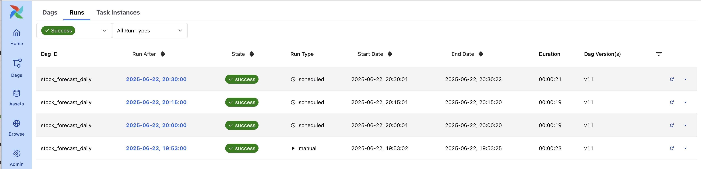
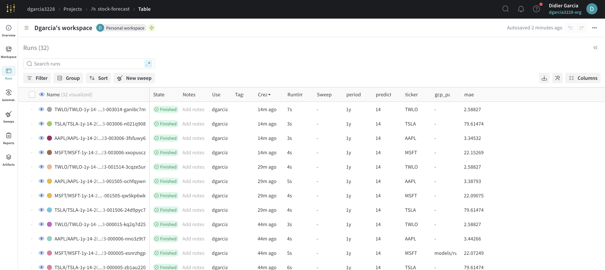
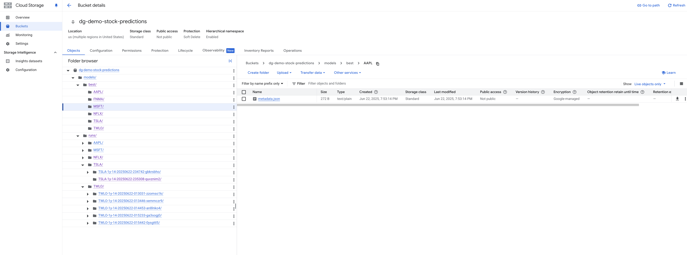

# Stock Predictions with Airflow, Prophet, wandb, and GCP

This project demonstrates how to orchestrate the training and evaluation of stock price prediction models using [Facebook Prophet](https://facebook.github.io/prophet/), [Apache Airflow](https://airflow.apache.org/), [Weights & Biases (wandb)](https://wandb.ai/), and Google Cloud Storage (GCS).

## Features

- **Automated Data Download:** Fetches historical stock data from Yahoo Finance.
- **Model Training:** Trains Prophet models for multiple tickers.
- **Evaluation & Logging:** Evaluates models, logs metrics and plots to wandb.
- **Model Versioning:** Uploads models and metadata to GCS.
- **Orchestration:** Uses Airflow to schedule and manage model training workflows.
- **Dockerized:** All components run in containers for reproducibility.

---
#### Airflow Runs

#### Weights & Bias model runs

#### GCS Model Bucket


---

## Project Structure

```
.
├── airflow/
│   ├── dags/
│   │   └── stock_prediction_dag.py
│   ├── Dockerfile
│   ├── docker-compose.yaml
│   └── requirements.txt
├── src/
│   └── train_model.py
├── requirements.txt
├── .env
├── gc-auth.json
└── README.md
```

---

## Getting Started

### 1. Prerequisites

- [Docker](https://www.docker.com/get-started)
- [Docker Compose](https://docs.docker.com/compose/)
- Google Cloud service account with access to your GCS bucket
- [wandb](https://wandb.ai/) account and API key

### 2. Environment Variables

Create a `.env` file in the project root with the following variables:

```env
GCS_BUCKET_NAME=your-bucket-name
PROJECT_ID=your-gcp-project-id
GOOGLE_APPLICATION_CREDENTIALS=/app/gc-auth.json
WANDB_API_KEY=your-wandb-api-key
MODELS_DIR=models
BEST_MODEL_DIR=models/best
MODEL_RUNS_DIR=models/runs
```

### 3. GCP Credentials Setup

1. **Download your GCP service account JSON** and rename it to `gc-auth.json`
2. **Place `gc-auth.json` in the project root** (same directory as `.env`)
3. **Ensure the file has the correct permissions** (readable by the Docker container)

### 4. Build and Start Airflow

**Important:** Run docker compose from the `airflow/` directory:

```sh
cd airflow
docker compose up --build
```

- The Airflow UI will be available at [http://localhost:8080](http://localhost:8080).
- The first time you run Airflow in standalone mode, it will print the admin credentials in the logs.

### 5. Accessing Airflow UI

Check the logs for the admin password:

```sh
docker compose logs airflow
```

Look for a line like:

```
Admin user created with username: admin and password: <random_password>
```

Login with these credentials.

---

## Usage

- The Airflow DAG (`stock_forecast_daily`) will run every 15 minutes by default for testing.
- Model artifacts and metrics are logged to wandb and GCS.
- You can customize tickers and DAG schedule in `airflow/dags/stock_prediction_dag.py`.

**Default Configuration:**
- **Tickers:** AAPL, MSFT, TSLA, TWLO
- **Schedule:** Every 15 minutes (`*/15 * * * *`)
- **Training Period:** 1 year of historical data
- **Forecast Period:** 14 days

---

## Development

### Python Environment Setup

1. **Set Python Version with pyenv**
   ```sh
   pyenv install 3.11.8
   pyenv local 3.11.8
   ```

2. **Create and Activate Virtual Environment**
   ```sh
   python -m venv venv
   source venv/bin/activate  # On Unix/macOS
   # OR
   .\venv\Scripts\activate  # On Windows
   ```

3. **Verify Python Version**
   ```sh
   python --version  # Should output Python 3.11.8
   ```


- To run the training script locally:
  ```sh
  pip install -r requirements.txt
  python src/train_model.py --ticker AAPL --period 1y --forecast_periods 14
  ```

---

## Troubleshooting

### Common Issues

- **"no configuration file provided: not found"**
  - **Solution:** Make sure you're running `docker compose` from the `airflow/` directory, not the project root.

- **"FileNotFoundError: No such file or directory: gc-auth.json"**
  - **Solution:** Ensure `gc-auth.json` is in the project root and the path in `.env` is `/app/gc-auth.json`.

- **"DAG.__init__() got an unexpected keyword argument 'schedule_interval'"**
  - **Solution:** This is fixed in the current version. The DAG uses `schedule` instead of `schedule_interval` for Airflow 3.0+.

- **"PermissionError: Permission denied" with wandb artifacts**
  - **Solution:** The script now handles this gracefully. Models are still saved to GCS even if wandb artifacts fail.

- **Environment variables not being passed to tasks**
  - **Solution:** Check that your `.env` file is in the project root and the docker-compose.yaml references `../.env`.

### Debugging

The DAG includes a debug task that prints all environment variables. Check the `debug_env_vars` task logs to verify:
- Environment variables are set correctly
- File paths are accessible
- Credentials are properly mounted

---

## License

MIT License

---

## Acknowledgements

- [Facebook Prophet](https://facebook.github.io/prophet/)
- [Apache Airflow](https://airflow.apache.org/)
- [Weights & Biases](https://wandb.ai/)
- [Google Cloud Storage](https://cloud.google.com/storage)
- [Yahoo Finance](https://finance.yahoo.com/) 